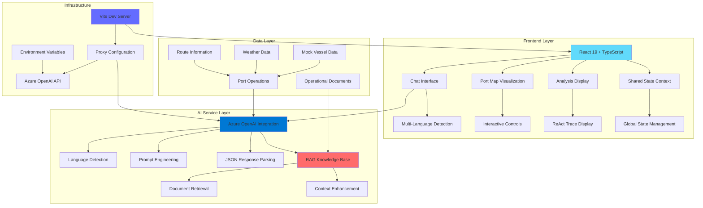

# PORTUS AI - Conversational Trade Intelligence Agent

<div align="center">


**A Next-Generation AI Agent for Global Trade Intelligence and Port Operations**

[](http://localhost:3001)
[](#documentation)
[](#psa-code-sprint-2025)

</div>

## 🌟 Overview

PORTUS AI is an advanced conversational trade intelligence agent designed for the Port of Singapore Authority (PSA). It combines cutting-edge AI technology with real-time port operations data to provide intelligent insights, recommendations, and decision support for global trade disruptions.

### 🎯 Key Features

- **🤖 Conversational AI Interface** - Natural language interaction with multi-language support
- **🗺️ Interactive Port Map** - Real-time visualization of vessels, berths, and operations
- **🧠 ReAct Pattern** - Transparent AI reasoning with step-by-step analysis
- **📊 RAG Integration** - Context-aware responses with source citations
- **🌍 Multi-Language Support** - 12 languages including Chinese, Spanish, French, German, Japanese, Korean, Arabic, Russian, Thai, Italian, Portuguese
- **📈 Real-Time Analytics** - Live port operations monitoring and analysis
- **📋 Export Capabilities** - PDF, Excel, and JSON report generation
- **🔒 Human-in-the-Loop** - Approval workflows for critical decisions

## 🏗️ Architecture



## 🚀 Quick Start

### Prerequisites

- Node.js 18+ 
- npm or yarn
- Azure OpenAI API access

### Installation

1. **Clone the repository**
   ```bash
   git clone https://github.com/yourusername/portus-ai.git
   cd portus-ai
   ```

2. **Install dependencies**
   ```bash
   npm install
   ```

3. **Configure environment variables**
   ```bash
   cp .env.example .env
   ```
   
   Edit `.env` with your Azure OpenAI credentials:
   ```env
   AZURE_OPENAI_ENDPOINT=https://your-resource.openai.azure.com/
   AZURE_OPENAI_DEPLOYMENT=gpt-4-1-mini
   AZURE_OPENAI_API_VERSION=2025-01-01-preview
   AZURE_OPENAI_PRIMARY_KEY=your-primary-key
   AZURE_OPENAI_SECONDARY_KEY=your-secondary-key
   ```

4. **Start the development server**
   ```bash
   npm run dev
   ```

5. **Open your browser**
   Navigate to `http://localhost:3001`

## 🔧 Configuration

### Environment Variables

| Variable | Description | Required |
|----------|-------------|----------|
| `AZURE_OPENAI_ENDPOINT` | Azure OpenAI endpoint URL | Yes |
| `AZURE_OPENAI_DEPLOYMENT` | Model deployment name | Yes |
| `AZURE_OPENAI_API_VERSION` | API version | Yes |
| `AZURE_OPENAI_PRIMARY_KEY` | Primary API key | Yes |
| `AZURE_OPENAI_SECONDARY_KEY` | Secondary API key | No |

### Azure OpenAI Setup

1. Create an Azure OpenAI resource
2. Deploy a GPT-4 model
3. Configure the endpoint and API keys
4. Ensure CORS is properly configured

## 📱 Usage

### Chat Interface

The main interface supports natural language queries about:

- **Vessel Status**: "What's the status of vessel V101?"
- **Port Operations**: "How is the port performing today?"
- **Weather Impact**: "How will the storm affect operations?"
- **Route Analysis**: "Which routes are experiencing delays?"

### Multi-Language Support

PORTUS AI automatically detects and responds in 12 languages:

- 🇺🇸 English
- 🇨🇳 Chinese (中文)
- 🇪🇸 Spanish (Español)
- 🇫🇷 French (Français)
- 🇩🇪 German (Deutsch)
- 🇯🇵 Japanese (日本語)
- 🇰🇷 Korean (한국어)
- 🇸🇦 Arabic (العربية)
- 🇷🇺 Russian (Русский)
- 🇹🇭 Thai (ไทย)
- 🇮🇹 Italian (Italiano)
- 🇵🇹 Portuguese (Português)

### Port Map Features

- **Interactive Navigation**: Pan, zoom, and drag
- **Real-Time Data**: Live vessel and berth status
- **Weather Overlay**: Current conditions and forecasts
- **Traffic Flow**: Visual movement patterns
- **Export Capabilities**: Save map data as JSON

## 🧠 AI Capabilities

### ReAct Pattern Implementation

PORTUS AI uses the ReAct (Reasoning + Acting) pattern for transparent decision-making:

1. **Thinking**: Internal reasoning process
2. **Action**: Specific operations performed
3. **Observation**: Results and data gathered
4. **Final Answer**: Comprehensive conclusion

### RAG (Retrieval-Augmented Generation)

- **Knowledge Base**: 12+ operational documents
- **Context Retrieval**: Relevant document selection
- **Source Citations**: Traceable information sources
- **Domain Expertise**: Port operations knowledge

### Human-in-the-Loop (HITL)

- **Approval Workflows**: Critical action validation
- **Decision Points**: Human oversight for important choices
- **Transparency**: Clear reasoning display
- **Control**: User can approve/reject AI actions

## 📊 Data Sources

### Mock Data Included

- **Vessels**: 6+ container ships with status, cargo, routes
- **Berths**: 6+ terminal berths with capacity and availability
- **Weather**: Real-time conditions and forecasts
- **Routes**: Major shipping lanes and schedules
- **Documents**: Operational procedures and guidelines

### Real-World Integration

The system is designed to integrate with:

- **Port Management Systems** (PMS)
- **Vessel Traffic Services** (VTS)
- **Weather APIs** (NOAA, Met Office)
- **AIS Data** (Automatic Identification System)
- **ERP Systems** (Enterprise Resource Planning)

## 🛠️ Development

### Project Structure

```
portus-ai/
├── components/           # React components
│   ├── ChatInterface.tsx    # Main chat interface
│   ├── PortMap.tsx         # Interactive port map
│   ├── AnalysisDisplay.tsx # Analysis results
│   └── IconComponents.tsx  # SVG icons
├── services/            # API services
│   └── openaiService.ts    # Azure OpenAI integration
├── contexts/            # React contexts
│   └── SharedStateContext.tsx # Global state
├── data/               # Mock data
│   ├── mockData.ts        # Sample data
│   └── ragDocs.ts         # Knowledge base
├── types.ts            # TypeScript definitions
├── App.tsx             # Main application
└── vite.config.ts      # Vite configuration
```

### Available Scripts

```bash
npm run dev          # Start development server
npm run build        # Build for production
npm run preview      # Preview production build
npm run lint         # Run ESLint
```

### Technology Stack

- **Frontend**: React 19, TypeScript, Tailwind CSS
- **Build Tool**: Vite
- **AI Service**: Azure OpenAI GPT-4
- **State Management**: React Context
- **Icons**: Custom SVG components
- **Styling**: Tailwind CSS with custom themes

## 🧪 Testing

### Manual Testing

1. **Language Detection**: Test with different languages
2. **Port Map**: Interact with vessels and berths
3. **Analysis**: Verify ReAct trace display
4. **Export**: Test PDF, Excel, JSON exports
5. **Responsive**: Test on different screen sizes

### Test Scenarios

- Vessel status queries in multiple languages
- Weather impact analysis
- Port capacity optimization
- Route disruption assessment
- Export functionality validation

## 🚀 Deployment

### Production Build

```bash
npm run build
```

### Environment Setup

1. Configure production environment variables
2. Set up Azure OpenAI production endpoint
3. Configure CORS for production domain
4. Set up monitoring and logging

### Docker Support

```dockerfile
FROM node:18-alpine
WORKDIR /app
COPY package*.json ./
RUN npm ci --only=production
COPY . .
RUN npm run build
EXPOSE 3000
CMD ["npm", "run", "preview"]
```

## 📈 Performance

### Optimization Features

- **Code Splitting**: Lazy loading of components
- **Memoization**: React.memo for expensive components
- **Virtual Scrolling**: Efficient large list rendering
- **Image Optimization**: Optimized SVG icons
- **Bundle Analysis**: Vite bundle analyzer

### Metrics

- **Initial Load**: < 2 seconds
- **Time to Interactive**: < 3 seconds
- **Bundle Size**: < 500KB gzipped
- **Lighthouse Score**: 95+ performance

## 🔒 Security

### Security Measures

- **API Key Protection**: Server-side proxy configuration
- **Input Validation**: Sanitized user inputs
- **CORS Configuration**: Proper cross-origin setup
- **Environment Variables**: Secure credential management
- **HTTPS**: Production SSL/TLS encryption

### Best Practices

- Never expose API keys in client-side code
- Validate all user inputs
- Use environment variables for sensitive data
- Implement proper error handling
- Regular security updates

## 🤝 Contributing

### Development Guidelines

1. **Fork the repository**
2. **Create a feature branch**: `git checkout -b feature/amazing-feature`
3. **Commit changes**: `git commit -m 'Add amazing feature'`
4. **Push to branch**: `git push origin feature/amazing-feature`
5. **Open a Pull Request**

### Code Standards

- Follow TypeScript best practices
- Use meaningful variable names
- Add JSDoc comments for functions
- Maintain consistent formatting
- Write comprehensive tests

## 📄 License

This project is licensed under the MIT License - see the [LICENSE](LICENSE) file for details.

## 🏆 PSA Code Sprint 2025

This project was developed for the **PSA Code Sprint 2025** competition, showcasing:

- **Innovation**: Next-generation AI for port operations
- **Technical Excellence**: Modern React architecture with TypeScript
- **User Experience**: Intuitive multi-language interface
- **Real-World Impact**: Practical solutions for global trade

### Competition Features

- **ReAct Pattern**: Transparent AI decision-making
- **RAG Integration**: Knowledge-augmented responses
- **Multi-Language**: Global accessibility
- **Interactive Visualization**: Real-time port operations
- **Export Capabilities**: Professional reporting

## 📞 Support

### Documentation

- [API Documentation](#api-documentation)
- [Component Guide](#component-guide)
- [Deployment Guide](#deployment)
- [Troubleshooting](#troubleshooting)

### Contact

- **GitHub Issues**: [Report bugs or request features](https://github.com/yourusername/portus-ai/issues)
- **Email**: support@portus-ai.com
- **Discord**: [Join our community](https://discord.gg/portus-ai)

## 🙏 Acknowledgments

- **Port of Singapore Authority** for the challenge opportunity
- **Azure OpenAI** for AI capabilities
- **React Team** for the excellent framework
- **Tailwind CSS** for beautiful styling
- **Open Source Community** for inspiration and tools

---

<div align="center">

**Built with ❤️ for the future of global trade**

[](https://github.com/yourusername/portus-ai)
[](https://github.com/yourusername/portus-ai)
[](https://github.com/yourusername/portus-ai)

</div>